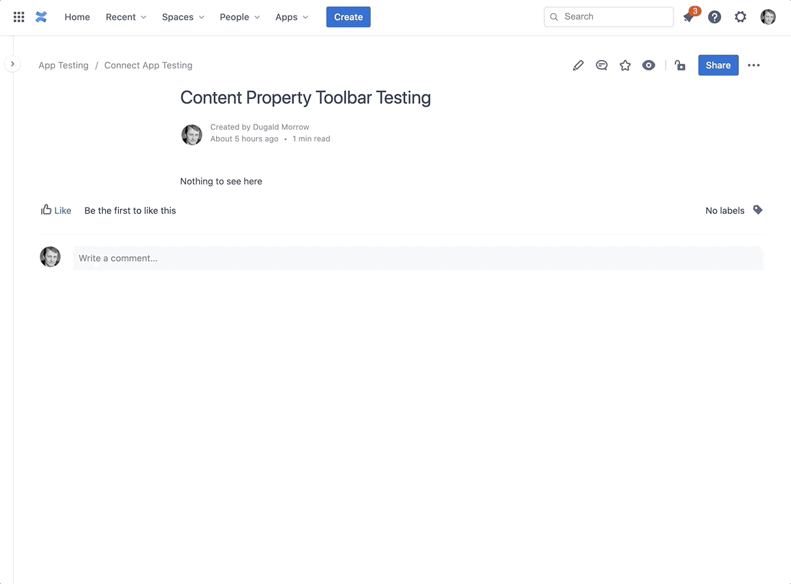

## Intro

This is a demo Atlassian Connect app designed to allow Confluence content properties to be viewed.

Here's a quick demo:

## Setup

This setup of this repo and the Github pages based deployment is based on the following article:

https://medium.com/mobile-web-dev/how-to-build-and-deploy-a-react-app-to-github-pages-in-less-than-5-minutes-d6c4ffd30f14
